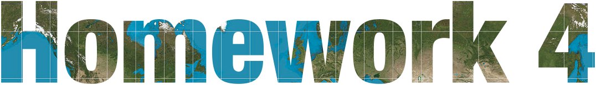
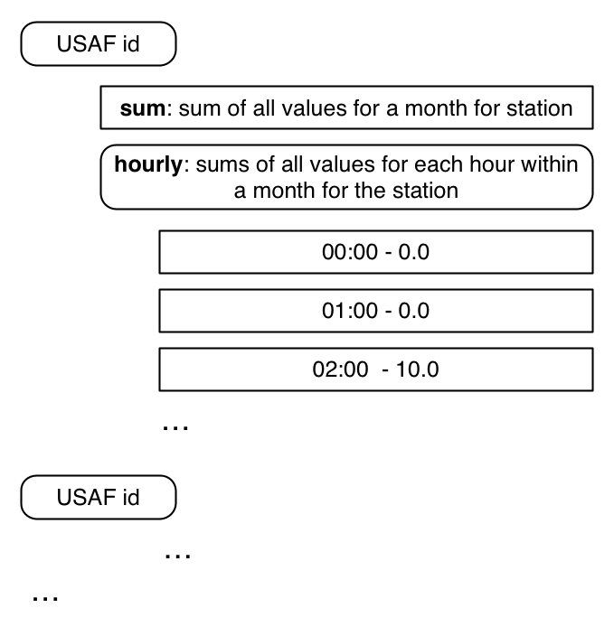
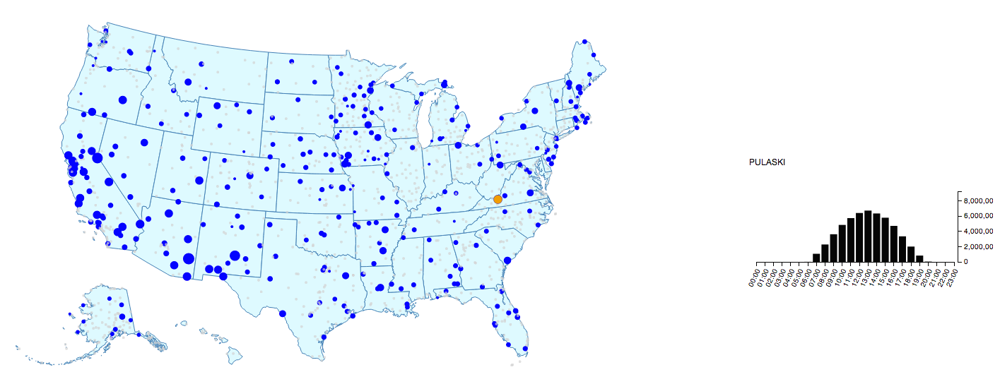
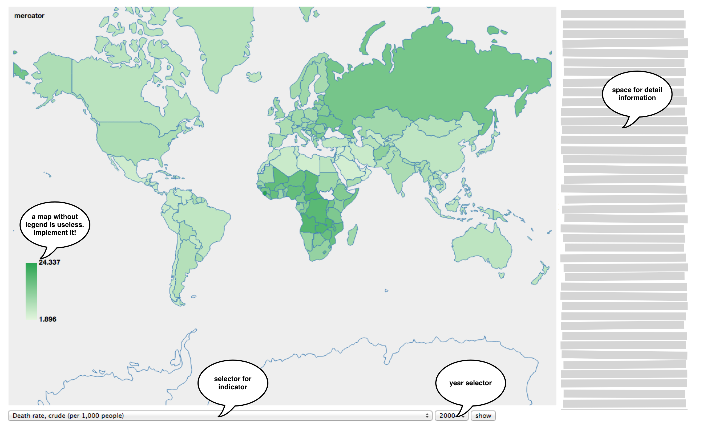

Many datasets contain geospatial information. Showing this data on maps allows us to reveal patterns of co-location and spatial distribution that might be hard to see otherwise. Furthermore, a map helps us orient ourselves and gain an intuitive overview, as we are often trained to read maps from childhood (e.g., the world map). Unsurprisingly, from simple local maps, such as those found in cave paintings, to world maps, to maps of stars and galaxies, drawing maps is a long-held tradition in human history.

One of the most prominent examples of the use of maps to visualize data and reveal patterns is [John Snow's map](http://en.wikipedia.org/wiki/File:Snow-cholera-map-1.jpg). By mapping cholera cases in the [1854 cholera outbreak](http://en.wikipedia.org/wiki/1854_Broad_Street_cholera_outbreak) in London, Snow was able to discover the cause of the outbreak, a public water pump. [Lecture 11](http://cm.dce.harvard.edu/2014/02/24028/publicationListing.shtml) gives an introduction and overview of maps in the area of visualization. 

In this homework, we will associate data with geographical maps and link them to additional information visualizations to get more detailed information. 


# Problem 0 

- Please fill out the survey for [Homework 3](https://docs.google.com/forms/d/1Cgaaq-ieXED6kcNcbOY0gcaqIep1qvuiWotl5lloONs/viewform).


# Problem 1 - Solar Radiation Data

The first problem uses data from the [National Solar Radiation Database](http://rredc.nrel.gov/solar/old_data/nsrdb/). The database contains [solar radiation](http://www.sciencedaily.com/articles/s/solar_radiation.htm) measures (in other words: the amount of sunlight) of over 1,000 locations within the US. From 1961 until 2010, the measures are recorded in an hourly resolution for many, but not all, stations. We are specifically using the [TMY3 dataset](http://rredc.nrel.gov/solar/old_data/nsrdb/1991-2005/tmy3/) which consists of more than 68 data dimensions that are partially original measurements and partially derived features from the original measurements. All data dimensions are mapped to a station ID ([USAFN](http://rredc.nrel.gov/solar/old_data/nsrdb/1991-2005/tmy3/by_USAFN.html)). The station ID maps to a station which has a location on the map. Take a look at the NSRDB web pages and explore the datasets.

Our visualization should allow access to the data geographically and along a time range. Before we start, we should first acquire skills in three different areas:

1. use projections to map latitude and longitude to x and y coordinates
2. draw a map in D3
3. review the use of data structures in JavaScript


## Creating a Map of the US

For the next few steps, follow along in `GeoUSA.html` and `GeoUSA.js`. Drawing a geographical map in D3 requires the mapping of geographical coordinates (longitude, latitude) to screen coordinates (x, y). The functions that do this are called projection methods. D3 already includes a set of the most common ones. For examples, take a look at the [documentation](https://github.com/mbostock/d3/wiki/Geo-Projections). These functions are standard techniques which preserve certain features when projecting positions from a sphere (i.e., the world) to a 2D plane. For this problem, we'll use the `d3.geo.albersUsa()` projection. The following two lines of code define a projection function which is centered in the middle of our visualization and a path generator which takes data in [GeoJSON](http://chimera.labs.oreilly.com/books/1230000000345/ch12.html#_json_meet_geojson) format to draw polygons (e.g., country shapes):

```javascript
var projection = d3.geo.albersUsa().translate([width / 2, height / 2]);

var path = d3.geo.path().projection(projection);
```  

As described earlier, you can use the `projection` function to map geographic locations to screen coordinates. Try this with the longitude and latitude information corresponding to [Boston](http://www.findlatitudeandlongitude.com/?loc=Boston,+MA+02266,+USA&id=8106). :

```javascript
var screencoord = projection([longitude, latitude]);
```

The `data` folder contains a [TopoJSON](https://github.com/mbostock/topojson/wiki) file (`us-named.json`) describing the shapes of United States features like states and counties. You can think of TopoJSON as a compressed version of GeoJSON. The following code fragment demonstrates how to load the data:

```javascript
d3.json("../data/us-named.json", function(error, data) {

    var usMap = var usMap = topojson.feature(data,data.objects.states).features // convertion TopoJSON to GeoJSON
    console.log(usMap); // look below what should be the outcome

    svg.selectAll(".states").data(usMap).enter()..... // and render it
    
});
```

This is an example of one object of the `usMap` variable. In addition to the geometrical information given in `geometry`, this object also contains additional property data. In this example, the additional properties are the state code (`code`) and state name (`name`). The `path` function defined above can take this object and generate the SVG path description to use in D3 (remember the [line](https://github.com/mbostock/d3/wiki/SVG-Shapes#wiki-svg_path) function).

```javascript
0: Object
	geometry: Object
	id: 2
	properties: Object
		code: "AK"
		name: "Alaska"
	__proto__: Object
	type: "Feature"
	__proto__: Object
```

If you have followed along until this point, congratulations! You've made your first map. Let's do something fancy with it. We want to zoom in and center on a state whenever we click on it. Take a look at [this example](http://bl.ocks.org/mbostock/2206590), which fortunately is in D3. Try to apply it to your map. We are now well prepared to show some data.


## Map and show the measurement stations

The file `NSRDB_StationsMeta.csv` contains information about all measurement stations for the NSRDB. For each station, it contains a unique ID ("USAF"), its name ("STATION"), and its location ("NSRDB_LAT (dd), NSRDB_LON(dd)"). We know how to read CSV data and how to map lat/long to x/y. Let's put the stations on the map.


## Data Wrangling

**DO NOT PUSH THE ORIGINAL `allData2003_2004.json` FILE TO GITHUB!**

The file `allData2003_2004.json` available [here](https://dl.dropboxusercontent.com/u/17074767/HW4/allData2003_2004.json.zip) gives you data for the years 2003 and 2004 from the NSRDB database, converted into JSON. It contains a map of USAF identifiers which links to an array of data values, one for every hour of the day. It looks like this:

```javascript
 "690150": [
        {
            "date": "Feb 1, 2003 1:00:00 AM",
            "value": 0.0
        },
        {
            "date": "Feb 1, 2003 2:00:00 AM",
            "value": 0.0
        },

```
The `value` field is taken from column 14 (global horizontal illuminance in 100 lux) of the TMY3 dataset and describes the "average total amount of direct and diffuse illuminance received on a horizontal surface during the 60-minute period ending at the timestamp" (i.e., hourly light).

This file is 100MB in size and is not well-suited for a D3 visualization project, so we should attempt to reduce the size by converting the data into a smaller, aggregated, more goal-oriented format. We want to create a data structure of the following format to get the aggregated values (see below for hints) for each hour of the day for every station:



Here's an example of what this looks like in JSON. Note that numbers are not correct!

```javascript
    "690150": {
      "sum": 11916800,
      "hourly": {
        "01:00:00 AM": 0,
        "02:00:00 AM": 0,
        "03:00:00 AM": 0,
        "04:00:00 AM": 0,
        "05:00:00 AM": 0,
        "06:00:00 AM": 0,
        "07:00:00 AM": 14800,
        "08:00:00 AM": 342600,
        "09:00:00 AM": 855300,
        "10:00:00 AM": 1293100,
        "11:00:00 AM": 1571400,
        "12:00:00 PM": 1796100,
        "13:00:00 PM": 1780600,
        "14:00:00 PM": 1616300,
        "15:00:00 PM": 1276500,
        "16:00:00 PM": 927000,
        "17:00:00 PM": 437600,
        "18:00:00 PM": 5500,
        "19:00:00 PM": 0,
        "20:00:00 PM": 0,
        "21:00:00 PM": 0,
        "22:00:00 PM": 0,
        "23:00:00 PM": 0,
        "00:00:00 AM": 0
      }
    },
    "690230": {...
```

One option to convert the data is to use JavaScript to create a JavaScript object which can then be written out as a JSON file. The file `AggregationMonthStation.html` contains a template you can use to do this. It contains a `saveToFile` function that takes a JavaScript object and writes it to a file. Use Chrome for this.

```javascript
 var saveToFile = function(object, filename){
        var blob, blobText;
        blobText = [JSON.stringify(object)];
        blob = new Blob(blobText, {
            type: "text/plain;charset=utf-8"
        });
        saveAs(blob, filename);
    }

```
The filesize should now be under 2MB. We are prepared to start with the visualization.


### A Word on Data Structures and Aggregation 

You've probably learned about data structures in other courses. If you have, the following sentence might save you a lot of time: "Objects in JavaScript resemble maps (key-value structure), while arrays resemble lists." If this sentence does not help you, take a look at the following example. 

Given a list of names, we want to group them into bins with respect to their first letter.

```javascript
var names = ["Kimbra","Elina","Brad","Johnathon","Archie","Elfriede","Melina","Jerrod","Elizabet"]
var aggregateMap = {}

names.forEach(function(d){

    var firstLetter = d[0]; // get first Letter (strings are arrays of characters)
    var secondLetter = d[1]; // just for explanation -- the second letter

    var nameList = aggregateMap[firstLetter] // get the value for key "firstLetter"

    if (nameList==undefined) // if there is no entry yet...
        nameList = []; //  .. then create one !!

    nameList.push(d) // add name to nameList

    aggregateMap[firstLetter]= nameList

})
console.log(aggregateMap);
```

If you look at the output you get an Object that has per key (`firstLetter`) a list of names:

```javascript
Object {K: Array[1], E: Array[3], B: Array[1], J: Array[2], A: Array[1]…}
	A: Array[1]
		0: "Archie"
		...
	B: Array[1]
		0: "Brad"
		...
	E: Array[3]
		0: "Elina"
		1: "Elfriede"
		2: "Elizabet"
		...
	...
```

To get acquainted with this method, try to create a map (object) that maps firstLetters to number of names. Note that this isn't part of the homework assignment, just an exercise.


## Tasks
For the tasks, you can use the provided templates in `GeoUSA.html` and `GeoUSA.js`.  Note that for the templates to fetch data properly, you must run a local server in the root directory of the homework using `python -m SimpleHTTPServer`.

The HTML file contains two `<div>` elements that you can use for your main visualization (`#vis`) and the detail visualization (`#detailVis`).

**AGAIN, DO NOT PUSH THE ORIGINAL `allData2003_2004.json` FILE TO GITHUB!**

### Subtask 1a: Create the map 
1. Implement a visualization of the US map.
2. Make the map zoomable.  Check out the previously linked example of [click-to-zoom via transform](http://bl.ocks.org/mbostock/2206590).
- Load the data from `NSRDB_StationsMeta.csv` and map every station to a circle on the map.

### Subtask 1b: Map the data
3. Convert the `allData2003_2004.json` file into a aggregated file `reducedMonthStationHour2003_2004.json`, as described above.
4. In `GeoUSA.js`, load the data from your aggregated file.
    - For each station, map the sum of all values to circle radius (hint: you have a `sum` field).
    - Encode the stations for which no data is available in a special way. For example, see the grey colored stations in the image embedded below.


### Subtask 1c: Interaction
1. Whenever you hover over a station with the mouse, the station name and the aggregated value should be shown as a tooltip. See [here](https://gist.github.com/biovisualize/1016860) or [here](http://bit.ly/1ewsRAQ) for examples.
2. When you click on a station, show the aggregated hourly values for this station in a detail (i.e., focus) visualization.
3. When you zoom in on a state, the circle radius should also "zoom in" and stay the same size relative to the state's size. This is known as [geometric zoom](http://bl.ocks.org/mbostock/3680999).


## Voila!
Use this image as guidance. The "Pulaski" station is selected for showing data in detail view. 




# Bonus Problem - WorldBank Data
Up to 1 extra point will be awarded for this problem. This problem is different from the previous problems in that we will not provide you with a step-by-step introduction. This should help you to judge the amount of time you need to go from a sketch or draft of an idea to a final visualization. Take this problem as serious preparation and a test run for the final project. 

We want to create a map for visualizing the [world development indicators](http://data.worldbank.org/indicator) found in the [World Bank Open Data](http://data.worldbank.org) database. The database contains per country and per year indicator values for a variety of topics like agriculture and rural development, climate change, economy and growth, health, and infrastructure.

## Task
1. Create a [choropleth map](http://en.wikipedia.org/wiki/Choropleth_map) that maps/displays a selected World Bank indicator for a specific year. A user should be able to select which indicator/year to display.
2. Implement the following features:
	- A selector for which World Bank indicator is being visualized by the map 
	- A selector for which year is being displayed
	- Add detailed information (i.e., more than just a name) to a selected country or to the selected indicator. This information can be displayed on a `mouseover` or `click` event, or in any other way you come up with. Be creative!

Below are some hints that might help you.

1. Use the web for inspiration. You can find many examples for choropleth maps online. For example, check out Mike Bostock's [visualization gallery](http://bl.ocks.org/mbostock) and his [population choropleth](http://bl.ocks.org/mbostock/6320825) map.
2. Understand the [WorldBank API](http://data.worldbank.org/developers/api-overview) 
3. There are two files in the `data` folder that help you:
	- `world_data.json` - a GeoJSON file containing information on country shapes, country names, and 3-letter country codes
	- `worldBank_indicators.csv` - a mapping of indicator description to indicator ID 
4. To fetch the data from the World Bank API, you can use a jQuery AJAX call to initiate a [JSONP](http://en.wikipedia.org/wiki/JSONP) request:

	```javascript
	 $.ajax({
        url: "http://api.worldbank.org/countries?format=jsonP&prefix=Getdata",
        jsonpCallback:'getdata',
        dataType:'jsonp',
        success: function (data, status){...
	```




The following is not part of the homework, only for your consideration. This table gives you estimates of the time needed to create the following files, to help you judge the amount of time this problem will take.

Task | Time | Comment
---|---|---
`world_data.json` | 2 hours | generating a GeoJSON file with country names
`worldBank_inidcators.csv` | 1 hour | importing feature list into MySQL and formulate query database
JSONP request | 1 hour | not well described in API


# ["That's all, folks!"](https://www.youtube.com/watch?v=gBzJGckMYO4)
